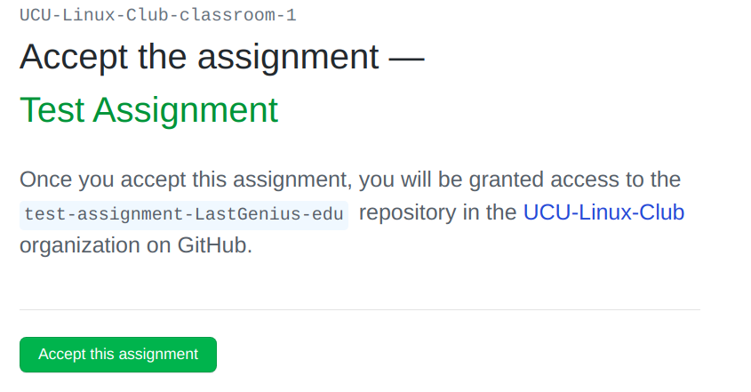
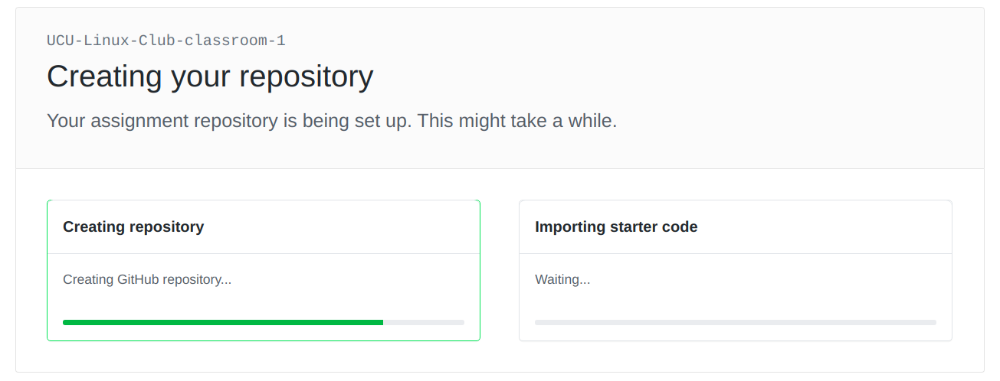

# Linux Club 2020
UCU Linux club 20/21 repo with the schedule, useful links and presentations.

I\`ll try to make a schedule for the first semester (12 weeks, not a lot).  This is going to be like a full course.

### First presentation.
Presentation link: (LINK HERE)

### Pre-requirements:
#### Very important:
- Personal laptop.
- [ArchLinux](https://www.archlinux.org/) on your PC (not VM) or other Arch-based systems (Can be [Manjaro](https://manjaro.org/downloads/official/gnome/), but NOT Debian- or Fedora-based systems. The manual for Arch Linux installation is [here](LINK HERE)
- Basic knowledge of English language (the course is for UCU students so it is not going to be a problem, I hope).
- Desire to learn something new and useful that will assist you throughout your career.
- [GitHub account](https://github.com/) - we are going to be using Github Classroom as well.
- **Webcams on** during online presentations.

#### Can be useful before the course:

- Watching the Revolution OS movie: [original version](https://www.youtube.com/watch?v=4vW62KqKJ5A) (which is better) or in [Russian](https://www.youtube.com/watch?v=n1F_MfLRlX0)
- Reading about Linux distros in general.

# Short schedule (DRAFT)

## Week 1
### Intro to Open-source applications, to Git, different distros descriptions.

## Week 2
### Intro to the terminal, prompt, Bash/Zsh & Oh-My-Zsh, first 4 lessons about them.

## Week 3
### Continuing with Bash/Zsh:  while loops, conditions, useful commands and more on Git.

## Week 4
### NeoVim & Tmux & Ranger.

## Week 5
### Learning about filesystems and Linux base directories. What is /, /bin /etc /root etc. What are mount point and permissions.

## Week 6
### Learning about tables, mbr vs gpt, grub, EFI/UEFI, what is what and how to work with them.

## Week 7
### Systemd. How to use systemctl, rfkill, what options are in the kernel.

## Week 8
### X.org, Gnome, Wayland, **i3**, KDE, XFCE, MATE etc.

##### Arch Linux installation required here.

##### As far as it is impossible to make full ofline course this semester, we won\`t learn STM and C programming, instead we will start intro to Rust language.

## Week 9
### Intro to the Rust programming language.

## Week 10
### 

## Week 11
### 

## Week 12
### 

# USAGE for students:

- Fork this repo (INSTRUCTION HERE)
- Make branch (INSTRACTION HERE)
- Complete tasks in the corresponding folder.

Each task is going to be completed in Github Classroom, with the link provided in the schedule above. First login requires you to:
	* To login using your Github account 
	
	
	* Set your nickname 
	(it's better to choose something meaningful for us to distinguish you easier) 
	

And for each task you are going to have to create a repository, 
complete it (the task described in the README.md and comments) and pass the tests. 

# Repo structure:

- images - just folder for all images.
- weeks - here will be tasks and materials to the corresponding weeks.
- additional - folder with additional tasks and their descriptions. 
- docs - here you can find a lot of necessary docs or links to interesting articles, resources.

# Usage for mentors
- Fork the repo.
- Add/fix/delete something.
- Make a PR.

Alternatively, you can ask me to make you as a contributor. But then I also recommend to make your branch and do PR\`s as well.
