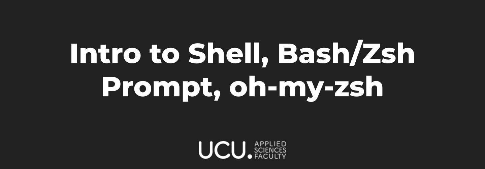
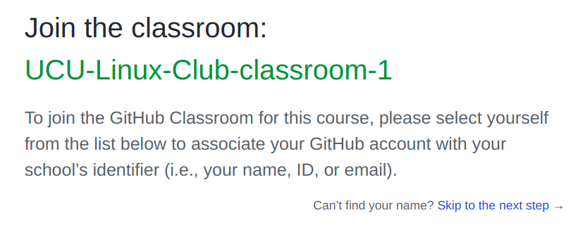

# Linux Club 2020
Official repository of UCU student-organized Linux Club 20/21 with the schedule, useful links and presentations.

### Pre-requirements:
- Personal laptop.
- [ArchLinux](https://www.archlinux.org/) on your PC (not VM) or other Arch-based systems. 
Can be [Manjaro](https://manjaro.org/downloads/official/gnome/), but NOT Debian- or Fedora-based systems. 
	- Manual for Arch Linux installation [here](./docs/arch_manual.md)
	- Manual for Manjaro installation [here](./docs/manjaro_manual.md)
- GNOM3 + Gnome shell or i3, **BUT** not (KDE, XFCE, MATE, Sway etc).
- Basic knowledge of English language
- [GitHub account](https://github.com/) - we are going to be using Github Classroom as well.
- **Webcams on** during online presentations.
- Desire to learn something new and useful that will assist you throughout your career.
#### For Mac users
If you are going to visit the club all time, the best is to install Arch/Manjaro native. If not:
- Package manager [brew](brew.sh)
... coming soon

### Project structure

* [Useful resources, links and documentation](./docs)
* [Week directories with useful resources](./resources)


### Can be useful before the course:

- Watching the Revolution OS movie: [original version](https://www.youtube.com/watch?v=4vW62KqKJ5A) (which is better) or in [Russian](https://www.youtube.com/watch?v=n1F_MfLRlX0)
- Reading about Linux distros in general [Wiki page on Linux](https://en.wikipedia.org/wiki/Linux), [Wiki page on Linux distributions](https://en.wikipedia.org/wiki/Linux_distribution)

# Short schedule
**Presentations are only available for `ucu.edu.ua` accounts**
## Week 0
[](https://docs.google.com/presentation/d/1EbZjD7uIL3l39Jzz0QT-iJm46EA35rHrbKP2FhfYaxk/edit?usp=sharing)

## Week 1
[](https://docs.google.com/presentation/d/1Nkb3wOmKYSy03kwFEmKTIlg73rc286YW5q-caod5j5k/edit?usp=sharing)

## Week 2
[](https://docs.google.com/presentation/d/1FFq8y8JiED1F6LDFileied_j3WszPPxdANb-rxlKa8w/edit?usp=sharing)

## Week 3
[](https://docs.google.com/presentation/d/1yj23xudPqUavx9zbKJduQhicnYMuJiY3ge0oDYqkhvY/edit?usp=sharing)

## Week 4
[]()

## Week 5
[](https://docs.google.com/presentation/d/e/2PACX-1vTmkpOZMXZ5LhFshN5sTL15caN5JTDKdf2g7xMSfKtFoGc5sqOjhukygI6xi4whgRrPPbAucvT_VQIv/pub?start=false&loop=false&delayms=3000)

## Week 6
### Learning about tables, mbr vs gpt, grub, EFI/UEFI, what is what and how to work with them.
### Presentation [here]()

## Week 7
### Systemd. How to use systemctl, rfkill, what options are in the kernel.
### Presentation [here]()

## Week 8
### X.org, Gnome, Wayland, **i3**, KDE, XFCE, MATE etc.
### Presentation [here]()

##### Arch Linux installation required here.

##### As far as it is impossible to make full ofline course this semester, we won\`t learn STM and C programming, instead we will start intro to Rust language.

## Week 9
### Intro to the Rust programming language.

## Week 10
### 

## Week 11
### 

## Week 12
### 

# Usage for students:

-   
    Fork this repo
    
- ```git checkout -b yourbranch```

	Make a branch

- Complete tasks in the corresponding folder.

---

Each task is going to be completed in Github Classroom, with the link provided in the schedule above. First login requires you to:
	
* To login using your Github account 	


---

* Set your nickname 
(it's better to choose something meaningful for us to distinguish you easier) 


---

And for each task you are going to have to create a repository, 
complete it (the task described in the README.md and comments) and pass the tests. 


# Usage for mentors
- Fork the repo.
- Add/fix/delete something.
- Make a PR.

Alternatively, you can ask me to make you as a contributor. But then I also recommend to make your branch and do PRs as well.
